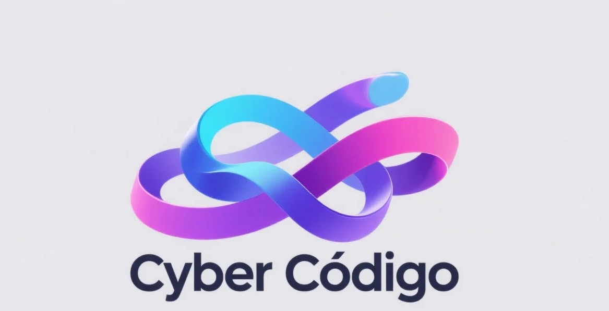

<div align="center">
  
  <h1>Cyber Código - Landing Page</h1>
  <p>El sitio web oficial de <strong>Cyber Código</strong>, una agencia de desarrollo web enfocada en crear soluciones digitales de alto impacto para negocios y startups.</p>
</div>

<div align="center">

[](https://nextjs.org/)
[](https://www.typescriptlang.org/)
[](https://sass-lang.com/)
[](https://supabase.io/)
[](https://vercel.com/)

</div>

---

Este repositorio contiene el código fuente de la landing page de **Cyber Código**. Construido desde cero con un enfoque en rendimiento, estética y funcionalidad, este proyecto sirve como la principal carta de presentación digital de la agencia.

**Visita el sitio en vivo:** [**cybercodigo-seven.vercel.app**](https://cybercodigo-seven.vercel.app/)

## ✨ Características Principales

-   **✍️ Gestor de Contenidos (CMS) con Supabase:**
    -   **Blog Dinámico:** Sistema de blog completo con creación, edición y eliminación de artículos desde un panel de administración.
    -   **Gestión de Testimonios:** Flujo de aprobación para testimonios de clientes, gestionado 100% desde el panel.
-   **🔐 Panel de Administración Seguro:**
    -   Ruta `/admin` protegida con sistema de login basado en sesiones (`iron-session`).
    -   APIs seguras que utilizan claves de servicio para operaciones privilegiadas.
-   **🎨 Diseño y Experiencia de Usuario (UX):**
    -   **Modo Oscuro/Claro:** Selector de tema persistente en toda la aplicación.
    -   **Menú Móvil Animado:** Menú hamburguesa elegante con animaciones fluidas.
    -   **Animaciones Sutiles:** Transiciones y efectos de entrada con `framer-motion` para una sensación premium.
-   **⚙️ Interactivo y Funcional:**
    -   **Calculadora de Cotizaciones:** Herramienta interactiva para que los clientes estimen costos.
    -   **Estudios de Caso Dinámicos:** Sección de portafolio que muestra proyectos detallados desde un archivo de datos.
    -   **Sección de FAQ:** Componente de acordeón para preguntas frecuentes.

## 🛠️ Tech Stack

| Tecnología | Propósito |
| :--- | :--- |
| **Next.js** | Framework de React para renderizado del lado del servidor (SSR) y sitios estáticos (SSG). |
| **TypeScript** | Superset de JavaScript para un tipado estático robusto y menos errores. |
| **SCSS/Sass** | Preprocesador de CSS para estilos modulares, anidados y mantenibles. |
| **Supabase** | Backend como servicio (BaaS) para la base de datos (PostgreSQL), autenticación y APIs. |
| **Framer Motion** | Biblioteca de animaciones para una experiencia de usuario fluida y declarativa. |
| **Iron Session** | Gestión de sesiones seguras y encriptadas para el panel de administración. |
| **Vercel** | Plataforma de despliegue optimizada para Next.js. |

## 🚀 Cómo Empezar

Sigue estos pasos para levantar el proyecto en tu entorno local.

### Prerrequisitos

-   [Node.js](https://nodejs.org/) (versión 18.x o superior)
-   `npm` o `yarn`
-   Una cuenta y un proyecto en [Supabase](https://supabase.io/).

### Instalación

1.  **Clona el repositorio:**
    ```sh
    git clone https://github.com/TU_USUARIO/TU_REPOSITORIO.git
    cd NOMBRE_DEL_REPOSITORIO
    ```

2.  **Instala las dependencias:**
    ```sh
    npm install
    ```

3.  **Configura las variables de entorno:**
    -   Crea un archivo llamado `.env.local` en la raíz del proyecto.
    -   Copia el contenido de `.env.example` (o usa la siguiente plantilla) y rellénalo con tus propias claves de Supabase y una contraseña para el admin.

    ```env
    # .env.local

    # Claves públicas de Supabase (seguras para exponer en el cliente)
    NEXT_PUBLIC_SUPABASE_URL=TU_URL_DE_PROYECTO_SUPABASE
    NEXT_PUBLIC_SUPABASE_ANON_KEY=TU_ANON_KEY_PUBLICA

    # Clave de servicio de Supabase (¡MANTENER SECRETA!)
    SUPABASE_SERVICE_ROLE_KEY=TU_SERVICE_ROLE_KEY_SECRETA

    # Contraseña para el panel de /admin
    ADMIN_PASSWORD="UNA_CONTRASEÑA_MUY_SEGURA"
    ```

### Ejecución

-   Para iniciar el servidor de desarrollo:
    ```sh
    npm run dev
    ```
    Abre [http://localhost:3000](http://localhost:3000) en tu navegador para ver el resultado.

¡Y listo! Ya tienes el proyecto corriendo en tu máquina local.
